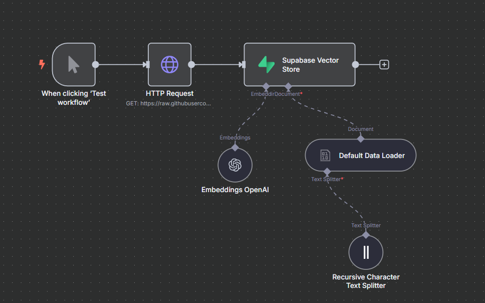
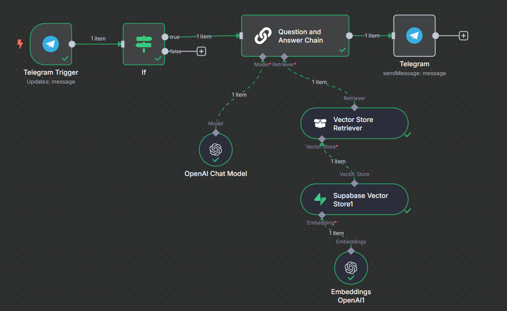

# RAG Workflow: de n8n a Python + LangChain

Este proyecto reproduce el mismo flujo de procesamiento e ingestión de documentos y chatbot con telegram vista en la clase de RAG de lab10: https://lab10.ai/talleres/rag, pero implementado con **Python** y **LangChain**: un bot de Telegram que responde consultas usando **Retrieval‑Augmented Generation** sobre la base de datos en Supabase.

---

## 📖 Descripción

El proyecto se divide en dos partes principales:

1.  **Ingestión de Datos**: Un proceso (representado aquí por un flujo de n8n o el script `embed_and_store_db.py`) que obtiene texto, lo divide en fragmentos (chunks), genera embeddings usando OpenAI y los almacena en Supabase.
2.  **Chatbot de Telegram**: Un bot de Telegram (implementado en n8n o con el script `chatbot.py` usando `python-telegram-bot` y LangChain) que recibe preguntas, busca documentos relevantes en Supabase, y genera respuestas usando un modelo de lenguaje de OpenAI (GPT-4o).

- **n8n**: Se tenía un workflow que:

1.  al hacer “Test workflow”:

    1. Hace una consutal GET y descargaba un TXT de GitHub,
    2. Lo fragmenta con el **Recursive Character Text Splitter**,
    3. Genera embeddings con OpenAI,
    4. Almacena en Supabase Vector Store.

2.  Bot de telegram
    1. Tigger de mensaje
    2. Question and answer chain
    3. Consulta a supabase
    4. Enviar mensaje de respuesta

- **Python + LangChain**: Se replica paso a paso el mismo flujo en `embed_and_store_db.py`, y en `chatbot.py`, un bot de Telegram que:

  1. recibe mensajes,
  2. recupera documentos relevantes de Supabase,
  3. genera la respuesta con GPT‑4o,
  4. la envía de vuelta al usuario.

---

## 🔄 Flujo n8n vs LangChain

## Parte 1: Ingestión de Datos (Supabase)

Este proceso prepara los datos para que el chatbot pueda consultarlos.

<summary>📈 Flujo en n8n (ingestión)</summary>



**Flujo Lógico (Conceptual, basado en n8n):**

1.  **`fetch_text` (Nodo HTTP Request)**: Obtiene el texto fuente (p. ej., desde una URL).
2.  **`RecursiveCharacterTextSplitter` (Default Data Loader + Text Splitter)**: Divide el texto largo en fragmentos más pequeños y manejables.
3.  **`OpenAIEmbeddings` (Embeddings OpenAI)**: Genera vectores (embeddings) para cada fragmento de texto utilizando los modelos de embedding de OpenAI.
4.  **`SupabaseVectorStore.add_documents` (Insert Documents en Supabase)**: Almacena los fragmentos de texto originales junto con sus embeddings correspondientes en una tabla de Supabase configurada para búsquedas vectoriales.

En Python (`create_db.py`):

```python
import dotenv
import os
import requests

from langchain_core.documents import Document

from langchain_text_splitters import RecursiveCharacterTextSplitter

from langchain_openai import OpenAIEmbeddings

from supabase.client import create_client
from langchain_community.vectorstores import SupabaseVectorStore

dotenv.load_dotenv()
# ——————————————————————————
# 1) HTTP request (nodo HTTP Request)
# ——————————————————————————


def fetch_text(url: str) -> str:
    """Equivalente al nodo HTTP Request de n8n."""
    resp = requests.get(url)
    resp.raise_for_status()
    return resp.text


# ——————————————————————————
# 2) Splitter (Default Data Loader + Recursive Character)
# ——————————————————————————
def split_into_documents(text: str) -> list[Document]:
    """
    Usa RecursiveCharacterTextSplitter para crear fragments.
    create_documents recibe lista de strings y retorna List[Document].
    """
    splitter = RecursiveCharacterTextSplitter(
        chunk_size=1000,
        chunk_overlap=100,
    )
    return splitter.create_documents([text])


# ——————————————————————————
# 3) Embeddings + Supabase Vector Store
# ——————————————————————————
def embed_and_store(docs: list[Document]):
    # — credenciales Supabase (igual que “Supabase account” en n8n)
    supabase_url = os.getenv("SUPABASE_URL")
    supabase_key = os.getenv("SUPABASE_SERVICE_KEY")
    supabase = create_client(supabase_url, supabase_key)

    # embeddings OpenAI
    embeddings = OpenAIEmbeddings()

    # vector store configurado igual que en n8n:
    #  • tabla: documentos_rag_2
    #  • batch_size: 200
    vector_store = SupabaseVectorStore(
        client=supabase,
        embedding=embeddings,
        table_name="documentos_rag_2",
        chunk_size=200,
        query_name="match_documents",
    )
    # inserta los documentos en batch de 200
    vector_store.add_documents(docs)
    print(f"✔️ Almacenados {len(docs)} fragmentos en `documentos_rag_2`.")


if __name__ == "__main__":
    # Trigger manual (equivalente a “When clicking ‘Test workflow’”)
    url = "https://raw.githubusercontent.com/juanhenaoparra/examples/refs/heads/main/truora-blog.txt"
    print("▶️ Obteniendo texto…")
    raw_text = fetch_text(url)

    print("🔪 Dividiendo en documentos…")
    documents = split_into_documents(raw_text)

    print("📥 Generando embeddings y almacenando…")
    embed_and_store(documents)

```

## Parte 2: Chatbot de Telegram (QA)

Este es el bot que interactúa con el usuario final.

- **Telegram Trigger**: Recibe mensajes nuevos del usuario en Telegram.
- **If**: Filtra mensajes que son comandos (empiezan con `/`).
- **Question and Answer Chain**:
  - Utiliza un `Vector Store Retriever` para buscar en `Supabase Vector Store` los fragmentos más relevantes para la pregunta del usuario.
  - Pasa la pregunta y los fragmentos recuperados a un `ChatOpenAI Chat Model` (GPT-4o).
  - Genera una respuesta basada en la información encontrada.
- **Telegram.sendMessage**: Envía la respuesta generada de vuelta al usuario en Telegram.

<summary>🤖 Flujo en n8n (QA + Telegram)</summary>



**Implementación en Python (`chatbot.py`):**

El script `chatbot.py` implementa la lógica del bot usando `python-telegram-bot` y LangChain:

```python
import dotenv
import os
import logging

# —— Telegram ——
from telegram import Update
from telegram.ext import (
    ApplicationBuilder,
    MessageHandler,
    ContextTypes,
    filters,
)

# —— LangChain ——
from langchain_openai import OpenAIEmbeddings, ChatOpenAI
from langchain.chains import RetrievalQA

# —— Supabase ——
from supabase.client import create_client
from langchain_community.vectorstores import SupabaseVectorStore

dotenv.load_dotenv()

# —————————————
# Configuración
# —————————————
logging.basicConfig(level=logging.INFO)
logger = logging.getLogger(__name__)

TELEGRAM_TOKEN = os.getenv("TELEGRAM_TOKEN")
SUPABASE_URL = os.getenv("SUPABASE_URL")
SUPABASE_KEY = os.getenv("SUPABASE_SERVICE_KEY")
OPENAI_API_KEY = os.getenv("OPENAI_API_KEY")

# —————————————
# 1) Inicializar Vector Store + Retriever
# —————————————
supabase = create_client(SUPABASE_URL, SUPABASE_KEY)
embeddings = OpenAIEmbeddings()
vector_store = SupabaseVectorStore(
    client=supabase,
    embedding=embeddings,
    table_name="documentos_rag_2",
    chunk_size=200,
    query_name="match_documents_lc",
)

retriever = vector_store.as_retriever(search_kwargs={"k": 4})

# —————————————
# 2) QA Chain
# —————————————
llm = ChatOpenAI(temperature=0, model="gpt-4o")

qa_chain = RetrievalQA.from_chain_type(
    llm=llm,
    chain_type="stuff",
    retriever=retriever,
    return_source_documents=False,
)

# —————————————
# 3) Handler de Telegram
# —————————————


async def handle_message(update: Update, context: ContextTypes.DEFAULT_TYPE):
    text = update.message.text.strip()
    if text.startswith("/"):
        # filtramos comandos
        return

    logger.info("🔍 Query: %s", text)
    try:
        response = await qa_chain.ainvoke({"query": text}, return_only_outputs=True)
        answer = response["result"]
    except Exception as e:
        logger.error("❌ Error en QA: %s", e)
        answer = "Lo siento, ocurrió un error."

    await update.message.reply_text(answer)

# —————————————
# 4) Arrancar el bot con ApplicationBuilder
# —————————————


def main():
    app = ApplicationBuilder().token(TELEGRAM_TOKEN).build()

    # Mensajes de texto que no sean comandos
    app.add_handler(
        MessageHandler(filters.TEXT & ~filters.COMMAND, handle_message)
    )

    logger.info("🤖 Bot arrancado, esperando mensajes…")
    app.run_polling()


if __name__ == "__main__":
    main()

```

## Mapeo n8n → Python / LangChain

| Componente n8n            | Equivalente Python / LangChain              |
| ------------------------- | ------------------------------------------- |
| Telegram Trigger          | `ApplicationBuilder().add_handler(...)`     |
| If (filtrar comandos)     | `if text.startswith("/"): `                 |
| Question and Answer Chain | `RetrievalQA.from_chain_type(...)`          |
| Model (dentro de QA)      | `ChatOpenAI(temperature=0, model="gpt-4o")` |
| Retriever (dentro de QA)  | `vector_store.as_retriever(...)`            |
| sendMessage               | `update.message.reply_text(...)`            |

## ⚙️ Requisitos

- **Python**: 3.10 o superior.
- **Cuenta de Supabase**:
  - Una instancia de base de datos.
  - Tablas configuradas: Necesitas una tabla (p. ej., `documentos_rag_2`) con una columna de tipo vector para almacenar los embeddings.
  - Funciones RPC: Funciones SQL para realizar la búsqueda de similitud vectorial (p. ej., `match_documents` y/o `match_documents_lc`).
- **Claves de API**:
  - `OPENAI_API_KEY`: Para acceder a los modelos de OpenAI (embeddings y chat).
  - `SUPABASE_URL`: La URL de tu instancia de Supabase.
  - `SUPABASE_SERVICE_KEY`: La clave de servicio (rol service_role) de Supabase para tener permisos de escritura y lectura privilegiados.
  - `TELEGRAM_TOKEN`: El token de tu bot de Telegram obtenido de BotFather.

## 🛠 Instalación

1. Clona el repositorio:

   ```bash
   git clone git@github.com:Jjat00/clase-n8n-rag-langchain.git
   cd clase-n8n-rag-langchain
   ```

2. Crea y activa un entorno virtual:

   ```bash
   python -m venv venv
   source venv/bin/activate # En Windows: venv\Scripts\activate
   ```

3. Instala las dependencias:
   ```bash
   pip install -r requirements.txt
   ```

## 🔧 Configuración

1. Crea un archivo llamado `.env` en la raíz del proyecto.
2. Añade tus claves de API y URLs al archivo `.env`:
   ```
   OPENAI_API_KEY=sk-xxxxxxxxxxxxxxxxxxxxxxxxxxxxxxxxxxxxxxxx
   SUPABASE_URL=https://<tu-proyecto>.supabase.co
   SUPABASE_SERVICE_KEY=<tu-clave-de-servicio-supabase>
   TELEGRAM_TOKEN=<tu-token-de-bot-de-telegram>
   ```

## ▶️ Ejecución

### Ingestión de Datos (Solo la primera vez o para actualizar):

1. Asegúrate de que tu script `embed_and_store_db.py` esté configurado para obtener el texto deseado (p. ej., de un archivo local o una URL).
2. Ejecuta el script de ingestión:
   ```bash
   python embed_and_store_db.py
   ```
   Este comando descargará, fragmentará, generará embeddings y almacenará los datos en tu tabla de Supabase.

### Ejecutar el Chatbot:

1. Una vez que los datos están en Supabase, inicia el bot de Telegram:
   ```bash
   python chatbot.py
   ```
2. El bot se conectará a Telegram y empezará a escuchar mensajes.
3. Envía un mensaje (que no sea un comando) a tu bot en Telegram. Debería responder utilizando la información de tu base de datos vectorial.

## 🗂 Estructura de Archivos

```
.
├── .env                # Archivo para variables de entorno (NO subir a Git)
├── README.md           # Este archivo
├── embed_and_store_db.py        # Script para la Parte 1: ingestión y almacenamiento en Supabase
├── chatbot.py          # Script para la Parte 2: bot de Telegram + RetrievalQA
├── requirements.txt    # Dependencias de Python
└── images/             # Carpeta para imágenes (diagramas, etc.)
    ├── ingest-workflow.png  # (Opcional) Diagrama del flujo de ingestión
    └── qa-workflow.png      # (Opcional) Diagrama del flujo del chatbot
```

## Configuración SQL para Supabase

```sql
-- 1. Habilitar la extensión pgvector (si no está habilitada)
create extension if not exists vector with schema extensions;

-- 2. Crear la tabla para almacenar documentos y embeddings
create table public.documentos_rag_2 (
    id uuid primary key default gen_random_uuid(),
    content text,         -- El fragmento de texto
    metadata jsonb,       -- Metadatos adicionales (opcional)
    embedding vector(1536) -- Dimension del vector depende del modelo de OpenAI (text-embedding-ada-002 usa 1536)
);

-- 3. Crear la función para buscar documentos similares (usada por LangChain)
-- Esta versión es compatible con langchain_community.vectorstores.SupabaseVectorStore
CREATE OR REPLACE FUNCTION public.match_documents_lc (
  query_embedding vector(1536),
  match_count      INT      DEFAULT NULL,
  filter           JSONB    DEFAULT '{}'
)
RETURNS TABLE (
  id         UUID,
  content    TEXT,
  similarity FLOAT
)
LANGUAGE SQL STABLE
AS $$
  -- Llama a la función original con los parámetros en el orden que espera
  SELECT
    docs.id,
    docs.content,
    1 - (docs.embedding <=> query_embedding) AS similarity
  FROM documentos_rag_2 AS docs
  WHERE docs.metadata @> filter
  ORDER BY docs.embedding <=> query_embedding
  LIMIT match_count;
$$;

```

**Nota**: Asegúrate de que el nombre de la tabla (`documentos_rag_2`) y el nombre de la función (`match_documents_lc`) coincidan con los usados en tu código Python (`create_db.py` y `chatbot.py`). La dimensión del vector (`vector(1536)`) debe coincidir con la salida del modelo de embeddings que uses (p.ej., `text-embedding-ada-002` de OpenAI usa 1536).
